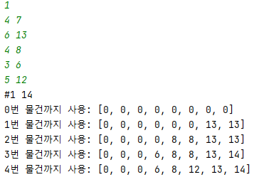
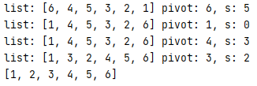
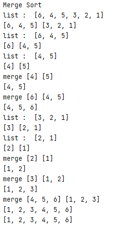

[SW Expert Academy](https://swexpertacademy.com/main/main.do) Problems

## IM

|      번호      |             풀이             |                      아무튼 추가할 내용                      |
| :------------: | :--------------------------: | :----------------------------------------------------------: |
|      2071      |      [링크](./2071.py)       |                                                              |
|      2072      |      [링크](./2072.py)       |                                                              |
|     3975_1     |     [링크](./3975_1.py)      |                             실패                             |
|     3975_2     |     [링크](./3975_2.py)      |                             성공                             |
|      2070      |      [링크](./2070.py)       |                                                              |
|      2058      |      [링크](./2058.py)       |                                                              |
|      2056      |      [링크](./2056.py)       |                                                              |
|      2047      |      [링크](./2047.py)       |                                                              |
|      2019      |      [링크](./2019.py)       |                                                              |
|      1926      |      [링크](./1926.py)       |                    [1926_2](./1926_2.py)                     |
|      2063      |      [링크](./2063.py)       |                                                              |
|      2068      |      [링크](./2068.py)       |                                                              |
|      2050      |      [링크](./2050.py)       |                                                              |
|      2046      |      [링크](./2046.py)       |                                                              |
|      2043      |      [링크](./2043.py)       |                                                              |
|      2029      |      [링크](./2029.py)       |              print(f_'') _ 부분 띄어쓰지 말 것               |
|      2027      |      [링크](./2027.py)       |                          다른 방법?                          |
|      2025      |      [링크](./2025.py)       |                                                              |
|      1938      |      [링크](./1938.py)       |                          다른 방법?                          |
|      1933      |      [링크](./1933.py)       |                                                              |
|      1936      |      [링크](./1936.py)       |                                                              |
|      1545      |      [링크](./1545.py)       |                                                              |
|      1895      |      [링크](./1895.py)       |                        실패(시간초과)                        |
|     1895_2     |     [링크](./1895_2.py)      |               성공(귀찮다고 다 for 하지 말기)                |
|      2007      |      [링크](./2007.py)       |                       20글자였다면..?                        |
|      2001      |      [링크](./2001.py)       |                      간단한 방법 없나?                       |
|      1989      |      [링크](./1989.py)       |                            회문 1                            |
|     1989_2     |     [링크](./1989_2.py)      |                            회문 2                            |
|      1986      |      [링크](./1986.py)       |                          홀수 짝수                           |
|      1984      |      [링크](./1984.py)       |             리스트에서 여러 개의 원소들을 지우기             |
|      1983      |      [링크](./1983.py)       |                       list로 조건 넣기                       |
|      1979      |      [링크](./1979.py)       |                      연속된 x 갯수 세기                      |
|      1976      |      [링크](./1976.py)       |                         시간 더하기                          |
|      1974      |      [링크](./1974.py)       |                        반복된 수 찾기                        |
|      1970      |      [링크](./1970.py)       |            거스름돈 몫을 이용하면 더 깔끔함             |
|      1966      |      [링크](./1966.py)       |                         무지성 정렬                          |
|      1961      |      [링크](./1961.py)       | 단계마다 내가 뭘 하려고 했는지 뭘 완료했는지 주석을 달자 |
|      1954      |      [링크](./1954.py)       |               어거지로 품/ 어떻게 풀어야되지?                |
|      1948      |      [링크](./1948.py)       |                                                              |
|      1946      |      [링크](./1946.py)       |                        딕셔너리 써봄                         |
|      1945      |      [링크](./1945.py)       |                           약수찾기                           |
|      1940      |      [링크](./1940.py)       |                    입력 형태 잘 보고 풀기                    |
|      1928      |      [링크](./1928.py)       | Base64 Decoder 주어진 조건을 보고 거꾸로 올라가 풀긴 했는데 이해가 안됨 |
|      1288      |      [링크](./1288.py)       |               set(반복) 으로 쉽게 나눌 수 있음               |
|      1285      |      [링크](./1285.py)       |                   최소값 찾기 & 갯수 세기                    |
|      1284      |      [링크](./1284.py)       |                         간단한 계산                          |
|      1204      |      [링크](./1204.py)       |                딕셔너리에서 밸류로 키 구하기                 |
|      1206      |      [링크](./1206.py)       |        리스트 차 아예 while에 인덱스 + 하는건???        |
|      1244      |      [링크](./1244.py)       |             나중에 다시 풀어보자 완전탐색??             |
|     13428      |      [링크](./13428.py)      |                         무지성비교 2                         |
|      1208      |      [링크](./1208.py)       |                 index기능때문에 빨리 풀린듯                  |
|      2806      |      [링크](./2806.py)       | 백트랙킹이라는게 있다는데 솔직히 이해가 되지 않는다 다시 풀어보자 ex)멱집합 요소 중 합이 N인 요소 출력하기 |
|      2817      |      [링크](./2817.py)       |  코드에 처절한 실패의 흔적이 있음 다시 한 번 살펴보자   |
|      2805      |      [링크](./2805.py)       |                  2차원배열 대각 조건 써봤음                  |
|      1215      |      [링크](./1215.py)       |                      2차원배열 회문검사                      |
|      1216      |      [링크](./1216.py)       | 2차원배열 회문검사 2 반복문이 너무 길고 많은지 코드 실행 시간이 너무 김 다른 방법 찾아보기 |
|      1220      |      [링크](./1220.py)       | 처음 답을 도출할 때 조건을 잘못 생각해 틀림 조건을 처음 정할 때 잘 생각하자 |
|     1220_2     |     [링크](./1220_2.py)      |              코드를 조금 정리함 + 재귀 연습???               |
|      1289      |      [링크](./1289.py)       |                                                              |
|      1225      |        [링크](./.py)         |             나머지와 더하기로 반복되는 수 만들기             |
|      4831      |        [링크](./.py)         | 리스트에서 최대 이동거리 등을 구할 때 인덱스를 뒤에서부터 뽑아보자 |
|      1860      |      [링크](./1860.py)       | 변수명 잘못쓰는 이상한 실수때문에... 어떤 변수가 뭘 의미하는지 잘 확인할것 |
|      5215      |      [링크](./5215.py)       |                  파이썬 튜터에서 독립해야돼                  |
|      4408      |      [링크](./4408.py)       | 복도 길 찾기 문제를 풀기전에 어떻게 단순화할지 고민하자 너무 복잡한 접근방법은 틀리기 쉬운 것 같다 |
|      5432      |     [링크](./5432_2.py)      | 막대기 자르기 조건에 따라 저장하고 빼는 형태의 알고리즘 잘 생각했으면 더 빨리 풀 수 있었을수도 있을 것 같다 |
|  palindrome_2  |  [링크](./palindrome_2.py)   | 가장 큰 무언가를 찾을 땐 레인지를 큰 수에서부터 접근해 break 를 쓰는 것도 좋은 것 같다 회문 같은 문제에서 자꾸 인덱스를 틀린다. 조심하자 |
|    ladder_1    |    [링크](./ladder_1.py)     | 기본으로 올라가고 while로 조건을 넣었으면 더 쉽게 풀었을 것 같다 |
|    이진탐색    | [링크](./binary_search_2.py) |     이진탐색에서 인덱스 선언 조건을 잘못 생각해 고생했다     |
|    부분집합    |   [링크](./subset_sum.py)    |          비트 연산을 이용한 부분집합 리스트 구하기           |
|    단어퍼즐    |        [링크](./.py)         | 검사 조건을 단순하게 하기 위해 2차원 배열을  0으로 감싸는 것도 한 방법이다 단, 이후 range 사용 시 주의하자 |
|    백만장자    |      [링크](./rich.py)       | 데이터의 크기가 매우 클 때 2중으로 루프를 돌리면 시간초과가 날 수도 있다. |
|    당근수확    |      [링크](./8702.py)       |                       기초 인덱스 문제                       |
|      토글      |     [링크](./toggle.py)      |   문제에 주어진 i j 조건이 달라서 헤맴 문제를 잘 읽자   |
|    x파리채     |     [링크](./x_play.py)      |                      왜 틀린지 모르겠음                      |
|  우주선 착륙   |      [링크](./10760.py)      |                dx, dy 사용해 주변 체크해보기                 |
|    고구마밭    |     [링크](./8810_2.py)      | 정말 디버깅이 안돼서 그냥 다 지우고 다시 만듬 다시 만들어보니 코드도 짧아지고 잘 동작함 문제를 잘 이해하고 풀자 |
|   배열부분합   |    [링크](./arr_sum_2.py)    |                       백트랙킹연습문제                       |
|    계산기2     |  [링크](./calculator_4.py)   |                         후위연산???                          |
|      포스      |     [링크](./forth_2.py)     |         eval()함수를 써봤으나 사이트내에선 작동안됨          |
|    미로찾기    |      [링크](./maze.py)       | 아마 다음 노드의 유효성 검사를 한 줄에 합치는게  더 보기 편한 것 같음 재귀함수의 return 쓰는 법: `if f(i,N):` |
|    토너먼트    |   [링크](./tournament.py)    |           아직도 재귀 구조에 완전히 익숙하지 않음            |
|  증가하는 수   |      [링크](./6190.py)       |                                                              |
|  대각 수 넣기  |      [링크](./1493.py)       |                 arr로 접근했다가 중간에 바꿈                 |
|   제곱 재귀    |      [링크](./1217.py)       |                       재귀 함수 만들기                       |
|      암호      |      [링크](./1240.py)       |              문제 지문 이해하는게 제일 어려웠음              |
| 대칭 문자 검사 |      [링크](./1234.py)       | 금방 끝날 줄 알았는데 의외로 고생함 처음 접근할 때 인덱스를 잘못 생각했음 |
|    패턴검사    |      [링크](./1213.py)       |           여러 번 검사할 때 i 인덱스 잘 생각해야함           |
|    피자굽기    |      [링크](./5099.py)       |            검사 완료한걸 -1로 바꾸는 방법도 있다             |

## APS

### 0322

|   이름    |                    풀이                     |
| :-------: | :-----------------------------------------: |
| dfs_stack | 스택을 이용한 dfs, 경로를 찾을 때 사용 가능 |
|  othello  |  dfs 리턴값 이용해 지난 경로의 요소 바꾸기  |

### 0323

| 이름  |                             풀이                             |
| :---: | :----------------------------------------------------------: |
| 1240  |                           패턴검사                           |
| bank  |              2진법 - 3진법 - 10진법 변환, 검사               |
|  bin  |                      소수점 2진수 변환                       |
|  dfs  |                           dfs기본                            |
|  hex  |     `int(number, n진법)` 으로 n진수를 10진수로 변환 가능     |
| micro | 문제의 조건 (손해를 보지 않음 = 수입, 지출 같아도 가능) 주의 |

### 0324

|  이름  |                       풀이                       |
| :----: | :----------------------------------------------: |
|  2105  |          아이디어는 있었는데 구현 실패           |
| 2105_2 |   idx를 받아서 direction 리스트로 방향 바꾸기    |
|  bin1  |          `format(int(alp, 16), '04b')`           |
|  bin2  |                                                  |
|  pwd   | 뭘 잘못한건지 IDE에서 돌아가는데 사이트에서 안됨 |

### 0325

| 이름  |                  풀이                   |
| :---: | :-------------------------------------: |
| swim  | dfs인데 분기마다 idx 증가값이 다른 문제 |
| swim2 |           dfs 안쓰고 DP 풀이            |

#### Dynamic Programming, DP

* 리스트를 이용해 이미 구한 답을 다음 답을 구하는 데 사용하는 방법
* 주어진 부분 문제의 정답을 한 번만 계산하고 다음에 이 값을 이용할 때 저장한 답을 바로 이용

### 0326

|    이름    |                풀이                |
| :--------: | :--------------------------------: |
|    5948    |          부분집합 만들기           |
| 3282(배낭) | dfs 백트래킹으로 풀었지만 시간초과 |
|   3282_2   |                 DP                 |

#### 0/1 배낭 문제

* 백트래킹으로 풀면 시간초과
* 2개의 변수를 고려해야하므로 2차원 배열을 사용한 dp로 풀이
* 
* 결국 문제풀이에 필요한 건 전단계의 정보이므로 재귀로 풀 수도 있다????

### 0329

|     이름      |                             풀이                             |
| :-----------: | :----------------------------------------------------------: |
| 최소합 구하기 |                           백트래킹                           |
|   전기카트    |      순열 만들기 + 매 순간 추가되는 원소의 합 저장하기       |
|   화물 운송   |                            그리디                            |
|     도크      | 끝나는 시간 - 걸리는 시간을 이용해 행열 만들어서 가능한 최댓값 구하기 |
|   베이비진    |                 카운트 배열의 연속된 수 검사                 |

#### 최소합

* 이동 방향을 함수 호출부분에 넣었음

#### 전기카트

* used 를 이용해 순열을 만들고 매 번 추가되는 원소의 합을 이용해 백트래킹
* 이 방법으로 순열 만드는게 아직 안익숙함

#### 도크

* 입력을 가공해 끝나는 시간 - 걸리는 시간으로 변화한 뒤 dp 비스무리하게 품

### 0330

|   이름    |                             풀이                             |
| :-------: | :----------------------------------------------------------: |
| quicksort |                            퀵소트                            |
| mergesort |                pop, append 를 사용한 머지소트                |
|   5204    | 머지소트로 풀었으나 원래 풀이방법으로는 시간초과 발생함 리스트를 미리 선언해놓고 인덱스로 접근하는 방법으로 바꿈 |

#### 퀵소트

* l : 피봇값보다 큰 값이 나올때까지 이동
* r: 피봇값보다 작은 값, 혹은 l 과 교차할때 까지 이동
  * 왜? l 과 r 이 교차하면 r은 피봇을 기준으로 큰 값과 작은 값의 사이에 위치함
* l 과 r 이 교차하면 lst[r] 과 피봇의 위치를 바꿈
  * 해당 피봇에 대해 정렬이 끝

#### 머지소트

### 0331

|       이름       |                            풀이                            |
| :--------------: | :--------------------------------------------------------: |
| 일 분배/ 최소 합 |                  순열 만들고 백트래킹하기                  |
|     전기버스     | dfs 백트래킹으로 품 dp 풀이법도 연습해봐야 할 것 같다 |
|     이진탐색     |    전에 했던 이진탐색 + 단계에 대한 체크가 필요한 문제     |
|      nqueen      |         대각 처리 조건을 인덱스 접근으로 풀어봤음          |
|      퀵소트      |                        퀵 소트 연습                        |

